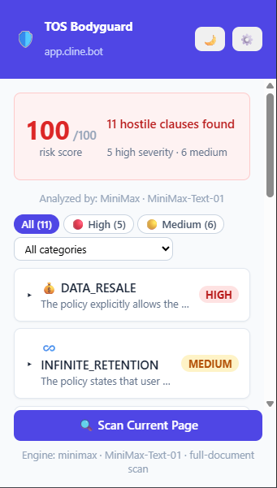

# 🛡️ TOS;DR (Terms Of Service;Didn't read) Bodyguard

**Nobody reads the Terms of Service. TOS Bodyguard does — and tells you exactly what to worry about.**

A Chrome extension that automatically finds a site's Privacy Policy & Terms, reads them with AI, and flags the clauses that are hostile to you — data resale, infinite retention, aggressive tracking, legal traps, shadow profiling — with plain-English explanations and the exact quote as evidence.

   

---
 

## 😤 The problem

Every site makes you agree to pages of legalese written to be unreadable. Buried inside:

- *"We may sell your personal data to third parties…"*
- *"We retain your data indefinitely, even after account deletion…"*
- *"You waive the right to a jury trial and class actions…"*

You click "Accept" because what choice do you have? **Now you have one: know what you're accepting.**

## ✨ What it does

- 🔍 **Auto-detects** Privacy Policy / Terms / Cookie links on every site you visit
- 🤖 **AI risk analysis** — flags 5 categories of hostile clauses, each with severity (HIGH/MEDIUM), a plain-English explanation, and the **verbatim quote** as proof
- 🏷️ **Instant badge** — red with the risk count, green when clean. Know before you scroll
- 🍪 **Auto-rejects cookie banners** using per-site rules (`rules.json`)
- 🚫 **100% private by default** — runs on Chrome's built-in on-device Gemini Nano. Your browsing never leaves your machine
- ⚡ **Optional cloud mode** — bring your own Gemini / Groq / OpenAI / MiniMax key for fast, **full-document** analysis (chunked + merged, so nothing gets skipped)
- 🌙 Dark mode, live scan queue, real progress bar, filterable risk list

## 🧠 How it works (30 seconds)

1. **Find** — the content script spots policy links (footer-first heuristics) and pulls their text.
2. **Analyze** — on-device Gemini Nano (or your cloud provider) scans for the 5 hostile-clause categories and returns strict JSON.
3. **Report** — the badge shows the count; the popup shows a **risk score (x/100)**, severity-tagged cards, and expandable evidence quotes.

No accounts. No servers of ours. No telemetry. Ever.

## 🚀 Install (2 minutes)

1. Clone or download this repo
2. Open `chrome://extensions` → enable **Developer mode** → **Load unpacked** → select the `tos-bodyguard/` folder
3. First-run guide in the popup walks you through AI setup (free on-device Nano **or** a cloud API key — your choice)

## 🔒 Privacy & your API keys

- Default mode is fully on-device — zero network calls with page content.
- Cloud keys are stored in per-extension sandboxed storage, read **only** by the service worker, and sent **only** to your chosen provider over HTTPS. Never logged, never in page DOM, never shared.
- Tip: use a spend-capped API key for extra peace of mind.

## ❓ FAQ

**Can the AI providers read my data or see what I do on websites?**
No. The only thing ever sent is the *policy document text* — a public page. Never your
cookies, accounts, history, form data, or even the URL. The API is stateless: it reads
the text, returns JSON, done. (One caveat: in cloud mode, don't use "Scan Current Page"
on pages with private content like open inboxes — it sends the visible page text.
Auto-scan only ever touches public policy pages. On-device Nano mode sends nothing, ever.)

**Is my API key safe?**
Stored in per-extension sandboxed storage (invisible to websites and other extensions),
read only by the service worker, sent only to your provider over HTTPS. Never logged,
never in page DOM. Residual risk is local device access — use a spend-capped key.

**Do the providers train on the policy text?**
OpenAI / Groq / MiniMax API tiers: no. Gemini API: paid tier no, free AI Studio tier may.

**Does the extension phone home?**
There is no home. No analytics, no telemetry, no accounts — read the code.

## 📂 Technical docs

Architecture, prompt design, test suite, and dev setup live in [`tos-bodyguard/README.md`](tos-bodyguard/README.md).

```bash
node tos-bodyguard/tests/run_tests.js   # 33 unit tests, mocked Chrome APIs
```

## 🤝 Contributing

Found a site it misses? A clause category we should add? Issues and PRs welcome.

---

*Because "I have read and agree to the Terms" shouldn't be the biggest lie on the internet.*
